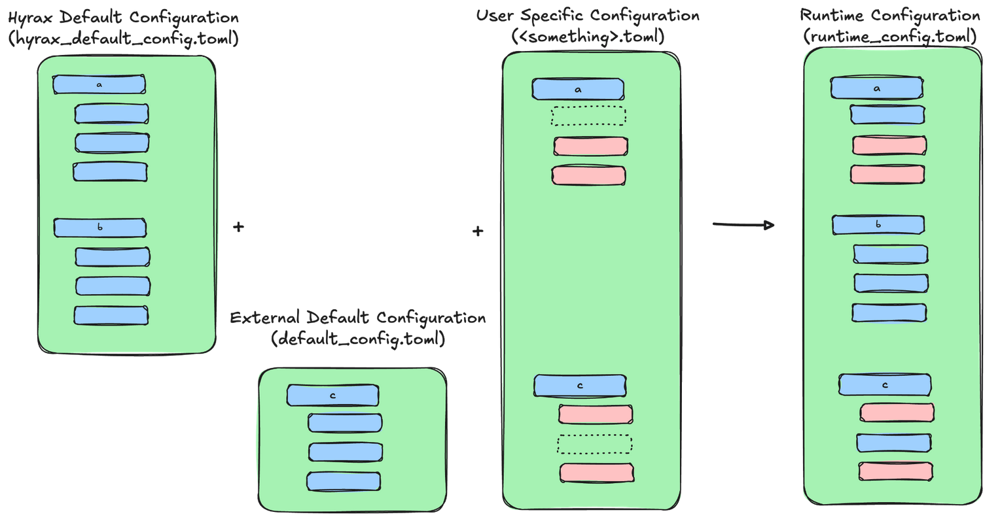

The ``Hyrax`` Configuration System
==================================

``hyrax`` makes extensive use of the config variables to manage the runtime enviroment of training and inference runs. There is a ``hyrax_default_config.toml``  file (full contents listed here), included with ``hyrax``, that contains every variable that ``hyrax`` could need to operate. To create a custom configuration file, simply create a ``.toml`` file and change variables as you see fit, or if you’re running with a custom dataset or model, add your own variables. 

Config variables are inherited from a hierarchy of sources, similar to ``python`` classes. First, ``hyrax`` will prioritize the variables set in the default configuration. Next, it will load the relevant default config of any custom ``hyrax`` packages that the user is utilizing. It determines what packages to include by checking what custom classes are loaded in initially and looking for the relevant default configs. If a package doesn’t have a default, ``hyrax`` will throw a warning. Finally, it will use whatever variables have been declared in the user defined config toml (see here for how to load those through a notebook/script or the CLI).

``hyrax`` will pass along all the configuration variables to the relevant models and dataset classes and allows them to configure the runtime through one system. This allows for extensibility and cross-compatibility within the broader “hyrax ecosystem”. From the point of view of the code, these configuration variables should be static. This makes it easier for researchers to develop code separate from the runtime environment.

A core design principle of ``hyrax`` is "code by config", meaning that all runtime parameters should be set through configuration files rather than hard-coded values. This approach enhances flexibility, reproducibility, and ease of experimentation, as users can modify configurations without altering the underlying codebase. This also facilitates sharing and collaboration, as configurations can be easily shared and adapted for different use cases while keeping fundamental models and datasets consistent.

Typed configuration schemas
--------------------------

Hyrax is introducing typed configuration models using Pydantic for safer validation and
better documentation. The first of these models formalizes the ``[model_inputs]`` table
used to describe datasets for training, validation, and inference. Two key schemas are
now available in :mod:`hyrax.config_schemas`:

* ``ModelInputsConfig`` – defines per-dataset settings (``dataset_class``, ``data_location``,
  ``fields``, ``primary_id_field``, and ``dataset_config``).
* ``ModelInputsDefinition`` – wraps the full ``model_inputs`` table, supporting
  ``train``, ``validate``, ``infer``, and additional dataset keys.

These models are passive definitions that can be imported by downstream modules or
third-party integrations to validate configuration structures before runtime.

After training is completed, ``hyrax`` will write out all of the variables (combined from all the various source configs) used at runtime in the runtime directory as a ``runtime_config.toml`` file, so that the user can see what variables were actually used in one place.
