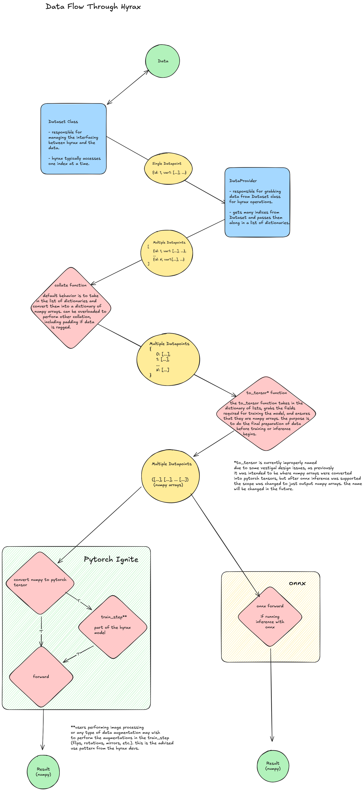

Data Flow Through Hyrax
========================

Accessing Data on Disk
----------------------

``Hyrax`` makes use of ``Dataset`` and ``DataProvider`` classes to act as interfaces between ``hyrax``, ``pytorch``, and data on disk. A main goal of ``hyrax`` development is to create a large, stable collection of dataset classes based on different data types and sources (like LSST, HSC, Gaia, Roman, etc.) that will allow researchers to hit the ground running with their machine learning projects.

``Datasets`` are the direct interface between the ``hyrax`` ecosystem and the desired data. The ``Dataset`` is responsible for handling the data on a per-index level (managing specific data types, labels, and other metadata), while the ``DataProvider`` is responsible for batching the data and passing it along toward the training step. This separation of concerns allows for great flexibility in how data is handled and processed.

The ``collate`` Function
------------------------

The ``collate`` function is responsible for taking in a batch of data from the ``DataProvider`` and transforming it into a format that can be more readily ingested by the model. By default, the ``collate`` function takes in a list of dictionaries (one dictionary per item in the batch) and converts each field into a list, passing along a dictionary of lists to the ``prepare_inputs`` function. The function is customizable and has options to handle ragged data with padding.

The ``prepare_inputs`` Function
--------------------------------

The ``prepare_inputs`` function is responsible for taking in the output of the ``collate`` function (a dictionary of lists) and converting the lists for each requested field into a numpy array. The function is customizable and acts as the last step in the data flow for the user to modify how data is transformed before being passed into the model.

.. note::
   The older function name ``to_tensor`` is deprecated but still supported for backward compatibility. Please use ``prepare_inputs`` in new code.

Model Input and Output Pipeline
-------------------------------

The data is then either sent to ``pytorch`` ignite for training or to ``onnx`` for inference. In the case of training, the data is converted into a tensor and passed into the model's ``train_step`` function. The model processes the data and returns the output predictions. If the user wishes to perform data augmentations, these can be set up in the model's ``train_step`` function as well.

In the ``onnx`` case, the data remains a numpy array throughout the model evaluation and to the result. Both paths result in the output being a numpy array.

Data Flow Diagram
-----------------
