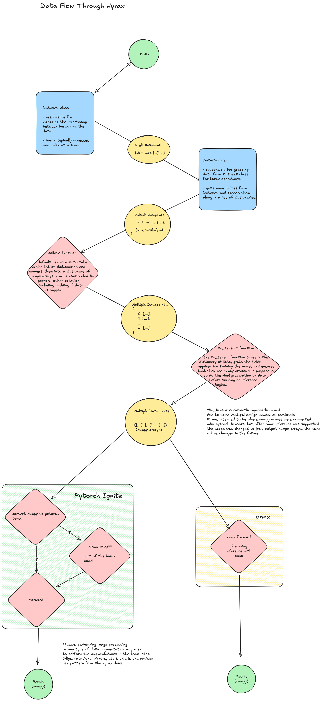

Data Flow Through Hyrax
========================

Accessing Data on Disk
----------------------

Hyrax uses ``Dataset`` and ``DataProvider`` classes as the interface between
data on disk and PyTorch. The :doc:`dataset class reference </dataset_class_reference>`
covers how to write your own ``Dataset``.

``Datasets`` are the direct interface between the Hyrax ecosystem and the
underlying data. A dataset is responsible for handling data on a per-item level
(managing specific data types, labels, and other metadata) via ``get_<field>(idx)``
methods. The ``DataProvider`` wraps one or more datasets, handles batching and
collation, and passes data onward toward training or inference. This separation
of concerns allows great flexibility in how data is handled and processed.

The ``collate`` Function
------------------------

The ``collate`` function is responsible for taking a batch of per-item
dictionaries from the ``DataProvider`` and combining them into a single
batch dictionary. By default, ``collate`` stacks each field's values into
a numpy array (using ``np.stack`` when shapes are uniform), producing a
dictionary of numpy arrays. The function is customizable and has options to
handle ragged data with padding. For a hands-on example of writing a custom
``collate``, see the :doc:`custom collation notebook </notebooks/custom_dataset_collation>`.

The ``prepare_inputs`` Function
--------------------------------

The ``prepare_inputs`` static method on the model class is responsible for
converting the collated batch dictionary into the format the model expects --
typically a tuple of numpy arrays (e.g. ``(images, labels)``). This is the last
step where the user can control how data is transformed before it reaches the
model. See the :doc:`custom prepare_inputs notebook </notebooks/custom_prepare_inputs>`
for examples, or the :doc:`model class reference </model_class_reference>` for
the method signature.

.. note::
   ``prepare_inputs`` should return numpy arrays, not PyTorch tensors.
   Hyrax handles the numpy-to-tensor conversion and device placement
   automatically in the training and inference engines.

.. note::
   The older function name ``to_tensor`` is deprecated but still supported for backward compatibility. Please use ``prepare_inputs`` in new code.

Training and Inference Pipelines
---------------------------------

After ``prepare_inputs``, data follows one of two paths:

**Training** — Hyrax converts the numpy arrays to PyTorch tensors, moves them
to the target device (CPU/GPU), and passes them to the model's ``train_batch``
method via a PyTorch Ignite engine. The model processes the data, computes a
loss, and returns a dictionary of metrics (which must include a ``"loss"`` key).
Validation and testing follow the same pattern using ``validate_batch`` and
``test_batch`` respectively.

**Inference** — The same conversion pipeline applies: numpy arrays become
tensors on the target device, and the model's ``infer_batch`` method is called.
The output tensors are converted back to numpy arrays and written to disk in
Lance format. For production deployments without PyTorch, models can be
:doc:`exported to ONNX </verbs>` and run via the ``engine`` verb.

Data Format Summary
-------------------

.. list-table::
   :header-rows: 1
   :widths: 40 60

   * - Stage
     - Format
   * - ``dataset.get_*(idx)``
     - Single item: numpy array, scalar, or string
   * - ``DataProvider.__getitem__(idx)``
     - Nested dict: ``{source_name: {field: value, ...}, "object_id": str}``
   * - After ``collate`` (DataLoader batch)
     - Dict of numpy arrays: ``{source_name: {field: np.ndarray, ...}}``
   * - After ``prepare_inputs``
     - Tuple of numpy arrays (or single ``np.ndarray``)
   * - Inside model methods
     - Tuple of ``torch.Tensor`` on device
   * - Inference output (saved to disk)
     - Numpy arrays in Lance format

Data Flow Diagram
-----------------

