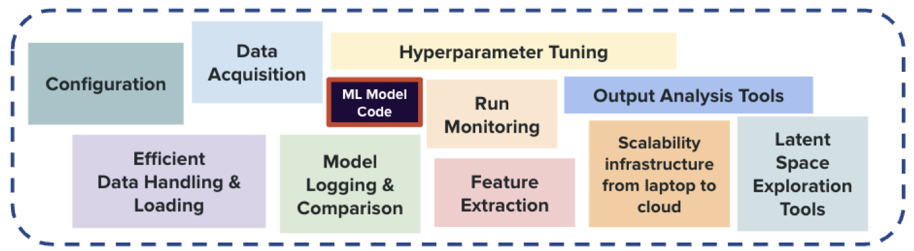
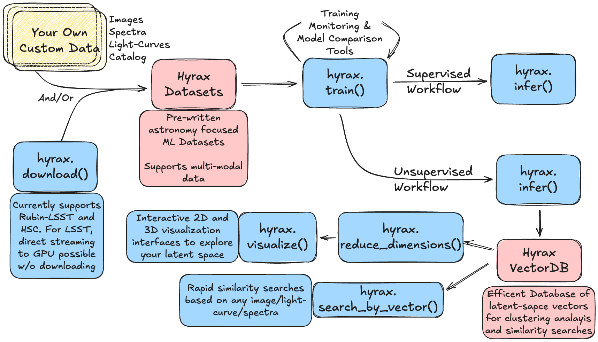

.. title:: Hyrax

.. admonition:: What is Hyrax?

   Hyrax is an extensible GPU-enabled framework that provides infrastructure for the full ML lifecycle in
   astronomy: from data acquisition and training to inference and experiment comparison, with capabilities
   including multimodal dataset support, integrated vector databases for similarity search,
   and interactive 2D/3D latent-space exploration for unsupervised discovery.

-------

Why Hyrax?
----------

With current and upcoming large astronomical surveys producing data at  unprecedented scale, the limiting  
factor for ML-driven discovery is increasingly not the data itself, but the  infrastructure required to work 
with it. Astronomers routinely spend a significant amount of their time on data wrangling, configuration 
management, and bespoke pipeline engineering — effort that comes directly at the expense of science; and is 
often not reusable by other research groups/teams resulting in duplicated effort.

   Hyrax lets users focus on writing their ML model code (center); while it provides astronomy-aware 
   infrastructure to handle everything else shown on this diagram. Figure from Ghosh, Oldag & Tauraso 
   et al.

-------

The Hyrax Workflow
--------------------

Hyrax is built around a small set of verbs that cover the main stages of an
astronomy ML workflow, from data access and training to inference, similarity
search, and interactive exploration.

   A typical Hyrax workflow. Retrieved or user-provided data are organized into
   astronomy-aware datasets, then passed through training and inference.
   For unsupervised workflows, Hyrax also supports vector-database search and
   interactive latent-space visualization.

.. code-block:: python

   from hyrax import Hyrax

   # Load a runtime configuration that defines the dataset, model, outputs, etc.
   h = Hyrax("path/to/runtime_config.toml")

   h.download()          # Retrieve cutouts from LSST, HSC, or other surveys
   h.train()             # Train any PyTorch model with automatic logging & multi-GPU support
   h.infer()             # Run inference and store results
   h.search_by_vector()  # Find similar objects via integrated vector databases
   h.visualize()         # Interactively explore latent spaces in 2D or 3D

Each step can be used on its own, or combined into an end-to-end workflow.

-------

Science with Hyrax
------------------

*Hyrax is science-agnostic* and is designed to support a wide range of astronomy workflows, from
ML-based classification/regression problems to discovery-oriented latent-space exploration. It can 
work on images, light curves, spectra, and combinations thereof. 

Below is an *incomplete* list of Hyrax science efforts being led by different PIs:

.. grid:: 1 1 2 2

   .. grid-item-card:: Extragalactic Unsupervised Discovery

      :bdg-primary:`Rubin DP1 | HSC` :bdg-secondary:`Unsupervised` :bdg-success:`Galaxies`

      Multi-model representation learning project to surface mergers, 
      low-surface-brightness galaxies, and scientifically interesting outliers 
      without any labeled training data.

   .. grid-item-card:: Cluster-Scale Lens Searches

      :bdg-primary:`Rubin DP1 | Euclid` :bdg-secondary:`Human in the Loop` :bdg-success:`Galaxies`

      A hybrid workflow combining latent-space clustering and visual inspection to identify lensed arcs in 
      cluster environments. 
      

.. grid:: 1 1 2 2

   .. grid-item-card:: Multimodal Transient Classification

      :bdg-primary:`ZTF + Spectra` :bdg-secondary:`Supervised` :bdg-success:`Time Domain`

      An AppleCiDEr-based workflow to classify transients using a 
      combination of light curves, spectra, cutout images, and metadata.

   .. grid-item-card:: Asteroid Search Filtering

      :bdg-primary:`DECam` :bdg-secondary:`Supervised` :bdg-success:`Solar System`

      A deep-learning based algorithm to filter out false-positives in moving-object searches performed by 
      KBMOD.
      

Detailed writeups for each of these applications are in preparation; and will be out soon. 

-------

First Steps
-----------

.. grid:: 1 1 2 2

   .. grid-item-card:: Getting Started
       :link: getting_started
       :link-type: doc

       Install Hyrax and train your first model

   .. grid-item-card:: Science Examples
       :link: science_examples
       :link-type: doc

       End-to-end workflows on real data

.. grid:: 1 1 2 2

   .. grid-item-card:: Core Concepts
       :link: core_concepts
       :link-type: doc

       Deep dives to get the most our of Hyrax

   .. grid-item-card:: Common Workflows
       :link: common_workflows
       :link-type: doc

       Reusable recipes for common Hyrax tasks

.. toctree::
   :hidden:

   Getting started <getting_started>
   Core concepts <core_concepts>
   Converting to Hyrax <external_libraries>
   Common workflows <common_workflows>
   Science examples <science_examples>
   Reference and FAQ <reference_and_faq>
