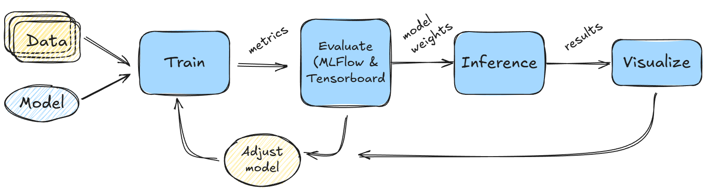

=====
Hyrax
=====

.. rubric:: A Low-Code Framework for Rapid Experimentation with ML & Unsupervised Discovery in Astronomy

With current and upcoming large astronomical surveys (e.g., Rubin, Roman, Euclid, DESI) producing data at 
unprecedented scale, the limiting factor for ML-driven discovery is increasingly not the data itself, but the 
infrastructure required to work with it. Astronomers routinely spend a significant amount of their time on data 
wrangling, configuration management, and bespoke pipeline engineering — effort that comes directly at the 
expense of science; and is often not reusable by other research groups/teams resulting in duplicated effort.

.. admonition:: What is Hyrax?

   Hyrax is an extensible GPU-enabled framework that provides infrastructure for the full ML lifecycle in
   astronomy: from data acquisition and training to inference and experiment comparison, with capabilities
   including multimodal dataset support, integrated vector databases for similarity search,
   and interactive 2D/3D latent-space exploration for unsupervised discovery.

.. figure:: _static/design_proposition.png
   :align: center
   :figclass: align-center
   :alt: Hyrax Design Philosophy
   :width: 90%

   Hyrax let's users focus on writing their ML model code (center); while it provides astronomy-aware 
   infrastructure to handle everything else shown on this diagram.

The Hyrax Workflow
--------------------

Hyrax organizes common ML tasks into a small set of high-level actions that
correspond to the major stages of an astronomy ML project:

   A typical Hyrax workflow. Data and a model flow through training, evaluation,
   and inference. Results can be explored interactively with Hyrax’s built-in
   visualization and similarity-search tools.

.. code-block:: python

   from hyrax import Hyrax
   h = Hyrax()

   h.download()    # Retrieve cutouts from LSST, HSC, or other surveys
   h.train()       # Train any PyTorch model with automatic logging & multi-GPU support
   h.infer()       # Run inference and store results
   h.search()      # Find similar objects via integrated vector databases
   h.visualize()   # Interactively explore latent spaces in 2D or 3D

These actions can be used independently or combined into end-to-end pipelines.
Hyrax is intentionally application-agnostic: it supports supervised and
unsupervised learning across a wide range of astronomical domains.

Real science, real data
-----------------------

Hyrax has been used for scientific discovery on data from major astronomical
surveys. Here are some representative applications:

.. grid:: 1 1 2 2

   .. grid-item-card:: Unsupervised discovery in Rubin DP1
      :link: pre_executed/unsupervised_image_extragalactic
      :link-type: doc

      Representation learning on 400,000 galaxies from Rubin Data Preview 1,
      surfacing new merger and low-surface-brightness candidates without any
      labeled training data.

   .. grid-item-card:: Gravitational lens finding
      :link: science_examples
      :link-type: doc

      Hybrid UMAP + density-based clustering to identify cluster-scale
      gravitationally lensed arc candidates in Rubin DP1 data.

.. grid:: 1 1 2 2

   .. grid-item-card:: Multimodal transient classification
      :link: science_examples
      :link-type: doc

      Early-time classification of ZTF transients by jointly leveraging
      light curves, spectra, image cutouts, and metadata.

   .. grid-item-card:: Distant asteroid searches
      :link: science_examples
      :link-type: doc

      Supervised false-positive filtering in shift-and-stack searches for
      distant solar system objects in the DEEP survey.

Get started
-----------

.. grid:: 1 1 2 2

   .. grid-item-card:: Getting Started
       :link: getting_started
       :link-type: doc

       Install Hyrax, train your first model, and run inference in minutes

   .. grid-item-card:: Science Examples
       :link: science_examples
       :link-type: doc

       End-to-end workflows on real survey data: galaxy morphology,
       transient classification, and more

.. grid:: 1 1 2 2

   .. grid-item-card:: Core Concepts
       :link: core_concepts
       :link-type: doc

       Configuration system, data flow, and how to bring your own models
       and datasets

   .. grid-item-card:: API Reference
       :link: reference_and_faq
       :link-type: doc

       Full API documentation and frequently asked questions

.. toctree::
   :hidden:

   Getting started <getting_started>
   Core concepts <core_concepts>
   Hyrax verbs <verbs>
   Common workflows <common_workflows>
   Science examples <science_examples>
   Scaling and Deployment <scaling_and_deployment>
   Sample Jupyter notebooks <notebooks>
   Reference and FAQ <reference_and_faq>
