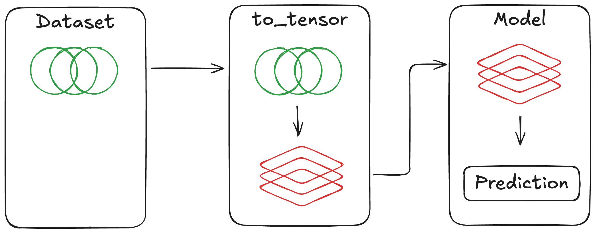

Required inputs
===============

Default values are provided for almost all configurable aspects of Hyrax, but
there are three essential pieces of information that a user must provide:

#. The model to use for training or inference
#. The data that will be provided to the model
#. The function needed to prepare the data for the model

   The user must specify three main components, Hyrax provides the rest.

Define the model
------------------
At its core, Hyrax is a framework for training and running machine learning models.
To do this, a user must provide the model that Hyrax will use for training or inference.
There is no reasonable default, so the user must provide Hyrax with a model.

Check out the :ref:`Getting Started tutorial <getting_started_specify_model>` for
an example of specifying a built-in model for training.

Define the data
-----------------
Hyrax needs to know what data to provide to the model during training or inference.
To do this, a user must specify a dataset class that Hyrax can use to load data
samples.

Check out the :ref:`Getting Started tutorial <getting_started_specify_data>` for
an example of specifying a built-in dataset for training.

Prepare the data
----------------
To support reusability, Hyrax encourages the separation of datasets and models.
i.e. the form of the data provided by a dataset class should not be customized for a
specific model, nor should a model architecture be hardcoded to a specific dataset.

In order to convert the content of a dataset into a form that is suitable for a model,
Hyrax requires a user-defined function that will prepare the data for the model.

As a contrived example, consider a dataset where each data point is composed of
three 2d arrays: "science", "mask", and "variance".
To be flexible, the dataset class that provides data from disk would return each
array individually.
The model may expect a single flattened array as input.
In this case, the user would need to define a `prepare_inputs` function that takes in
the structured data sample and stacks the arrays into a single array before
returning it.

The user may then want to quickly experiment with the model by first providing
only the "science" array as input, and later adding in the "variance" array as well.
By defining a custom `prepare_inputs` function, the user can easily modify how the
data is prepared for the model without needing to modify either the dataset or
the model code.

.. note::
   The older function name ``to_tensor`` is deprecated but still supported for backward compatibility. Please use ``prepare_inputs`` in new code.
